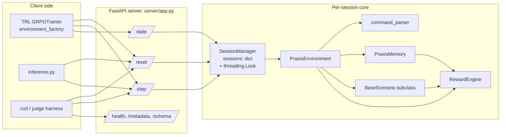
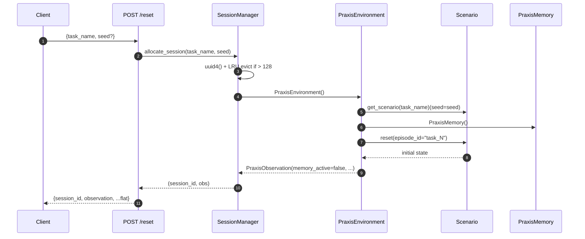
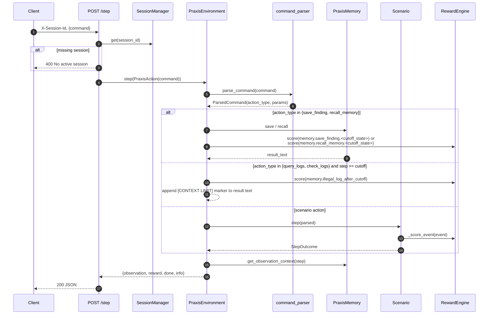
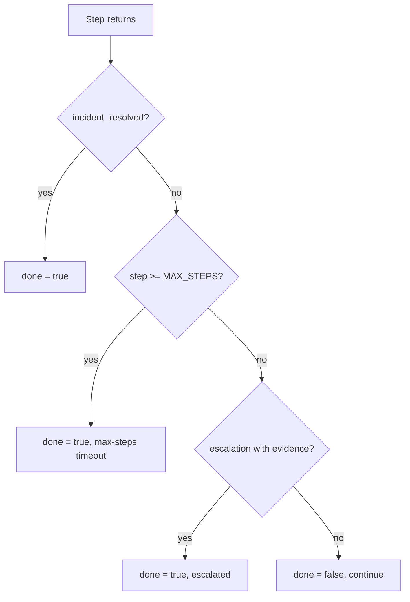

# Data Flow — End-to-End Praxis Trajectory

> Single-source diagrams that every issue can link to. Mirrors OpenEnv's
> `Environment / Action / Observation / State` contract from
> `OpenEnv/src/openenv/core/env_server/interfaces.py`.

---

## 1. Component map



---

## 2. Reset flow



Key invariants:

- `session_id` is a fresh UUID4 returned in the JSON body (not in a header).
- `seed` is forwarded only to scenarios that opt in (`procedural-incident`).
- Memory always resets in lockstep with the scenario.

---

## 3. Step flow (with memory branch)

Status: shipped in Issue #6 (`server/praxis_environment.py` + `server/session_manager.py`).



Observation rewrite rules (executed by `PraxisEnvironment.step`):

- If `step >= memory.CONTEXT_CUTOFF_STEP`, replace `observation.investigation_result` with `memory.get_observation_context(...)`.
- Always set `observation.memory_active = (step >= cutoff)`.
- Always set `observation.saved_findings_count = len(memory.saved_findings)`.

---

## 4. Reward composition

```mermaid
flowchart TD
    Event[Event tag] --> Lookup[event_values lookup<br/>per task in DEFAULT_REWARD_POLICIES]
    Lookup --> Comp[RewardBreakdown:<br/>investigation/diagnosis/<br/>remediation/escalation +<br/>memory bonus]
    Comp --> Step[time_pressure_cost_per_step *<br/>(step / max_steps)]
    Step --> Sum[Sum components]
    Sum --> Clamp["clamp_reward → [0.01, 0.99]"]
    Clamp --> Out[Returned to scenario / env]
```

Memory events feed into the same engine through new event tags (see [`RewardPolicy.md`](./RewardPolicy.md)):

- `memory.save_finding.before_cutoff` → +0.05
- `memory.save_finding.after_cutoff` → +0.02
- `memory.recall_memory.before_cutoff` → +0.01
- `memory.recall_memory.after_cutoff` → +0.08
- `memory.illegal_log_after_cutoff` → −0.05 (log queries after cutoff)

---

## 5. Episode terminator decision tree



Driven by `BaseScenario.is_done()` plus the memory-aware `PraxisEnvironment` wrapper.

---

## 6. Cross-doc links

- Endpoints / schemas: [`APIContract.md`](./APIContract.md)
- Sessions + locking: [`ConcurrencyModel.md`](./ConcurrencyModel.md)
- Memory tool design: [`MemoryModel.md`](./MemoryModel.md)
- Per-task reward maps: [`RewardPolicy.md`](./RewardPolicy.md)
- Scenario inventory: [`ScenarioCatalog.md`](./ScenarioCatalog.md)
- Reset/step/done lifecycle: [`SessionLifecycle.md`](./SessionLifecycle.md)
