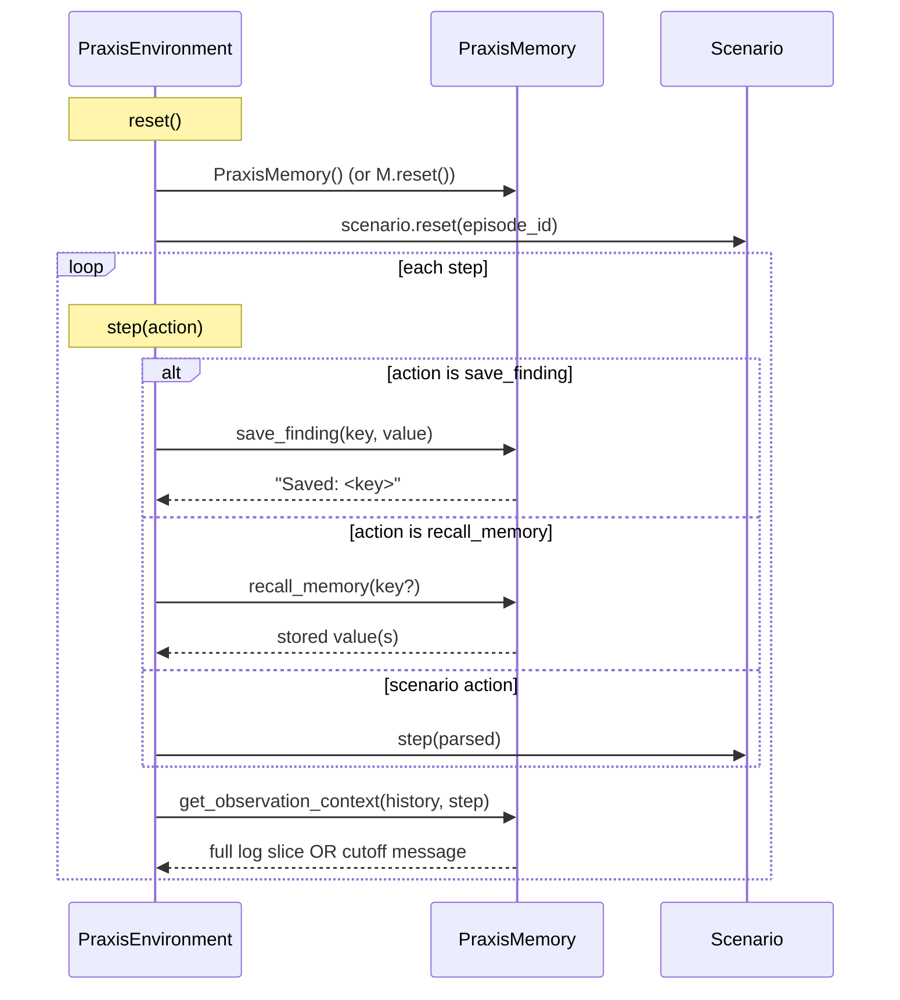

# Memory Model — `PraxisMemory` (the Theme #2 moat)

> Forces the agent to **decide what to remember**. After step 30 the full
> investigation log is gone from the observation; only what the agent saved
> via `save_finding` survives.
>
> Grounding: arxiv AgeMem ("memory operations as tool-based actions, GRPO-compatible")
> and arxiv 2601.07190 ("Context Bloat… passive summarization fails") — both cited in
> [`idea/Task.md`](../../Task.md) lines 130, 150, 161–171.

---

## 1. Class contract

Status: shipped in `praxis_env/memory.py` (Issue #3).

```python
# praxis_env/memory.py
from dataclasses import dataclass, field
from typing import Optional

@dataclass
class PraxisMemory:
    """Agent-controlled working memory. Reset per episode."""

    saved_findings: dict[str, str] = field(default_factory=dict)
    CONTEXT_CUTOFF_STEP: int = 30   # tunable per-scenario (mega-incident keeps 30; procedural easy = 10)

    def save_finding(self, key: str, value: str) -> str: ...
    def recall_memory(self, key: Optional[str] = None) -> str: ...
    def get_observation_context(self, full_log: list[str], step: int) -> str: ...
    def is_active(self, step: int) -> bool: ...
    def reset(self) -> None: ...
```

- Pure Python, no I/O, no randomness. Determinism is a hard requirement.
- `key` and `value` are arbitrary agent-chosen strings (we don't validate semantics — judges score whether the agent later proves it remembered the right things).
- Storage is a flat `dict[str, str]`; later keys with the same name overwrite. We do **not** version findings; the agent can use compound keys (`"step_12.db_pool"`) if it wants timeline.

---

## 2. Lifecycle



`get_observation_context` is the single function that decides whether the agent sees the raw log or a summary. Both branches return strings — the observation type doesn't change shape.

---

## 3. Cutoff behaviour (the differentiator)

Status: shipped in `praxis_env/memory.py::PraxisMemory.get_observation_context` (Issue #3).

```python
def get_observation_context(self, full_log: list[str], step: int) -> str:
    if step < self.CONTEXT_CUTOFF_STEP:
        return "\n".join(full_log[-10:]) if full_log else ""
    return (
        f"[CONTEXT LIMIT REACHED — Step {step}/{self.CONTEXT_CUTOFF_STEP}]\n"
        f"Full investigation log is no longer available.\n"
        f"Your saved findings:\n{self.recall_memory()}\n\n"
        f"Use recall_memory to retrieve specific findings.\n"
        f"Use save_finding to persist new evidence."
    )
```

Why this is the moat (verbatim from `idea/Task.md` line 169):

> _"After step 30, the context is gone. Only what the agent chose to save is available. This forces preemptive memory management — a capability no current benchmark tests, and every production AI system needs."_

---

## 4. Reward integration (cross-link to `RewardPolicy.md`)

Memory events emit reward tags that every task policy maps to a number:

| Event tag                            | Default value | Meaning                                     |
| ------------------------------------ | ------------- | ------------------------------------------- |
| `memory.save_finding.before_cutoff`  | +0.05         | Proactive: agent saved before pressure.     |
| `memory.save_finding.after_cutoff`   | +0.02         | Reactive: still useful but late.            |
| `memory.recall_memory.before_cutoff` | +0.01         | Tiny — discourages habitual recall.         |
| `memory.recall_memory.after_cutoff`  | +0.08         | Strong: planning paid off.                  |
| `memory.illegal_log_after_cutoff`    | −0.05         | Querying logs after cutoff (logs are gone). |
| `memory.empty_recall_after_cutoff`   | −0.02         | Recall after cutoff with no saved findings. |

These are added to **every task's** `event_values` so the memory tools work for all scenarios. See [`RewardPolicy.md`](./RewardPolicy.md) for full per-task tables.

Cross-link: ADR-13 additionally enforces an evidence gate where `remediation.*` scores are zeroed until root-cause diagnosis is confirmed, preventing memory-assisted reward hacking before diagnosis.

---

## 5. Command-parser hook

`server/command_parser.py` adds two entries to `KNOWN_ACTIONS`:

```python
KNOWN_ACTIONS = frozenset({
    "query_logs", "check_metrics", "check_deps", "check_config", "check_runbook",
    "diagnose", "restart_service", "rollback_deploy", "scale_resource",
    "kill_query", "escalate",
    "save_finding",     # NEW
    "recall_memory",    # NEW
})
```

Grammar:

| Command                                  | Params (parsed)                                                        |
| ---------------------------------------- | ---------------------------------------------------------------------- |
| `save_finding key=<key> value=<finding>` | `key=str` (required), `value=str` (required, free text after `value=`) |
| `recall_memory`                          | none — returns all findings                                            |
| `recall_memory key=<key>`                | `key=str` (optional)                                                   |

`value=` parsing follows the same "everything after `value=` is the value" rule the parser already uses for `escalate reason=...`. Issue #4 details the regex.

---

## 6. `models.AVAILABLE_COMMANDS` extension

```python
AVAILABLE_COMMANDS = [
    # ... existing entries ...
    "save_finding key=<key> value=<finding>",
    "recall_memory",
    "recall_memory key=<key>",
]
```

So agents discovering the action space via the observation see the new tools without docs.

Issue #2 also requires these commands to be advertised immediately on baseline observations,
even before the memory hook rewrites `investigation_result`; `memory_active=false` and
`saved_findings_count=0` are the safe defaults until cutoff logic is active.

---

## 7. Determinism + reset

- `PraxisMemory()` is constructed inside `PraxisEnvironment.__init__` and **fully reset on every episode reset** (`saved_findings.clear()`).
- No timestamps, no randomness, no I/O. `pytest tests/test_memory.py -q` (Issue #13) re-runs the same trajectory and asserts byte-identical observations + rewards.

---

## 8. Per-scenario overrides

| Task                           | `CONTEXT_CUTOFF_STEP`                | Rationale                                   |
| ------------------------------ | ------------------------------------ | ------------------------------------------- |
| `single-service-alert`         | 30 (default — never reached, max=15) | No-op for short tasks.                      |
| `ambiguous-incident`           | 30 (rarely reached, max=25)          | Memory tools available but not pressured.   |
| `cascading-failure`            | 30 (rarely reached, max=20)          | Same.                                       |
| `memory-leak`                  | 20                                   | Forces use; max_steps=25.                   |
| `cascading-platform-failure`   | 30                                   | The headline: 120-step task, cutoff at 25%. |
| `procedural-incident` (easy)   | 8                                    | Auto-calibrated by difficulty.              |
| `procedural-incident` (medium) | 15                                   |                                             |
| `procedural-incident` (hard)   | 25                                   |                                             |

The `PraxisEnvironment` reads cutoff from `scenario.MEMORY_CUTOFF_OVERRIDE` if defined, else falls back to the `PraxisMemory` class constant.

---

## 9. What good looks like (judging-aligned)

- Innovation (40%): explicit memory-as-tool API; no other team has it.
- Storytelling (30%): live demo shows the cutoff banner appear at step 30 and the agent recover via `recall_memory`.
- Rewards (20%): the +0.08 / −0.05 deltas are visible in reward curves.
- Pipeline (10%): GRPO can directly train against these reward tags via `environment_factory`.
