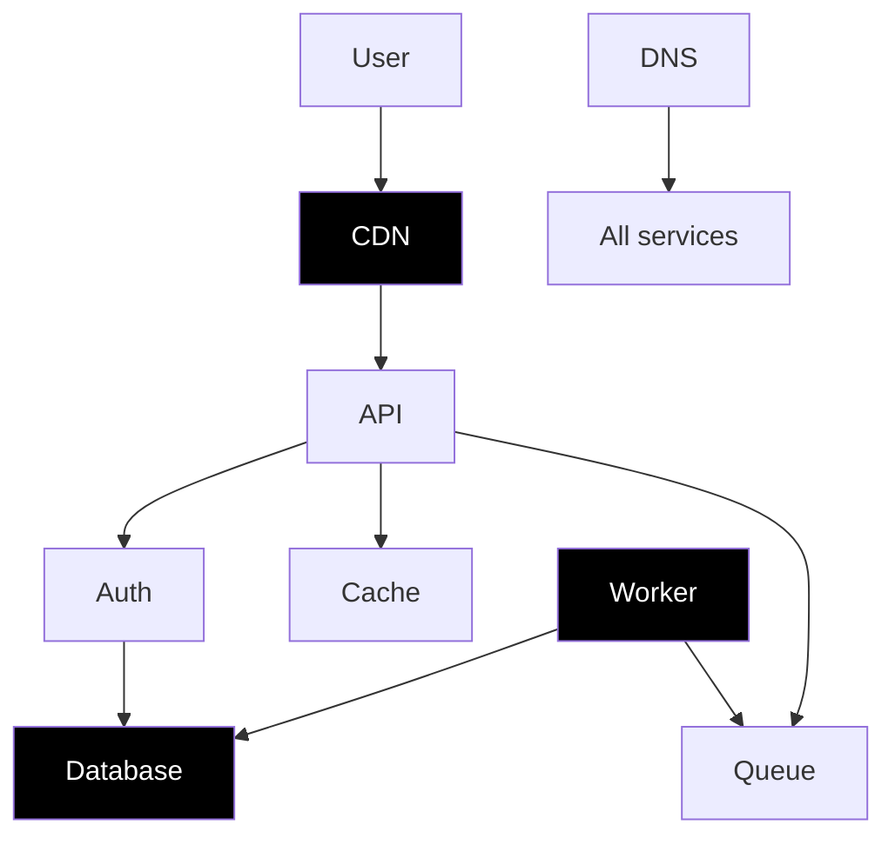

# Scenario Catalog — All 6 Tasks (post-Theme-#2)

> 4 shipping scenarios + 2 new ones. Every entry lists topology, root cause(s),
> red herrings, optimal path, target reward, and memory pressure.
>
> Authoritative implementation references live in
> [`praxis_env/scenarios/`](../../../praxis_env/scenarios) and
> [`server/reward.py`](../../../server/reward.py). See
> [`RewardPolicy.md`](./RewardPolicy.md) for full event tables and
> [`MemoryModel.md`](./MemoryModel.md) for cutoffs.

---

## 1. Catalog at a glance

| #   | Task                         | Difficulty    | `MAX_STEPS` | Memory cutoff | Target optimal | Status             |
| --- | ---------------------------- | ------------- | ----------- | ------------- | -------------- | ------------------ |
| 1   | `single-service-alert`       | easy          | 15          | n/a (≥15)     | ~0.63          | shipped            |
| 2   | `ambiguous-incident`         | medium        | 25          | 30 (n/a)      | ~0.71          | shipped            |
| 3   | `cascading-failure`          | hard          | 20          | 30 (n/a)      | ~0.46          | shipped            |
| 4   | `memory-leak`                | hard          | 25          | 20            | ~0.48          | shipped            |
| 5   | `cascading-platform-failure` | hard          | 120         | 30            | ~0.55          | **NEW (Issue #7)** |
| 6   | `procedural-incident`        | easy/med/hard | 15/25/50    | 8/15/25       | scaled         | **NEW (Issue #8)** |

All scenarios extend [`praxis_env/scenarios/base.BaseScenario`](../../../praxis_env/scenarios/base.py); rewards remain in `[0.01, 0.99]` per `clamp_reward()`.

---

## 2. Existing scenarios (recap)

Detailed designs live in [`idea/Architecture/scenario_design.md`](../../Architecture/scenario_design.md). Here we capture only the deltas needed for the Theme #2 story.

### `single-service-alert` — auth bad config

- Root cause: `bad_config` (typo `auhdb`).
- Memory: not exercised. Tools available but no cutoff pressure.

### `ambiguous-incident` — DNS misconfig

- Root cause: `dns_misconfiguration`. Evidence threshold = 4 investigations across ≥3 services + ≥1 infra.
- Memory: not exercised; agents tend to finish in <25 steps.

### `cascading-failure` — DB pool exhausted

- Root cause: `db_connection_pool_exhausted` (runaway analytics query).
- Memory: not exercised.

### `memory-leak` — worker OOM

- Root cause: gradual heap growth from caching unbounded session objects.
- **Memory IS exercised**: `MEMORY_CUTOFF_OVERRIDE = 20`; the agent must save the heap-growth observation by step 20 or lose the trail.

---

## 3. NEW Scenario 5 — `cascading-platform-failure` (mega-incident)

The headline Theme #2 task. 120 steps, 8 services, **3 simultaneous root causes**, 6 red herrings, sparse milestone rewards.

### 3.1 Topology



Services: `api`, `auth`, `database`, `cache`, `worker`, `queue`, `cdn`, `dns`. Bold = root-cause source.

### 3.2 Root causes (must all be diagnosed)

| Tag                  | Description                                                                                        |
| -------------------- | -------------------------------------------------------------------------------------------------- |
| `db_pool_corrupted`  | A migration deployed at T-30 corrupted the connection pool config; new connections drop after 60s. |
| `cdn_tls_expired`    | TLS cert on the CDN expired at incident start; ~12% of requests fail handshake.                    |
| `worker_memory_leak` | A batch-size mis-config makes worker heap grow ~80MB/min, OOMs every ~25 min.                      |

### 3.3 Red herrings

`cache_eviction_spike`, `dns_ttl_warning`, `queue_backlog`, `api_latency_symptom`, `auth_token_rotation`, `lb_rebalance` — all real signals, none of them the cause.

### 3.4 State machine (memory-aware)

```
Steps 1–30   Full context. Investigate + save_finding.
Steps 31–60  Cutoff fired. Use recall_memory; should ID root cause #1.
Steps 61–90  Identify root causes #2 and #3 using memory + new evidence.
Steps 91–120 Remediation phase. Recall the 3 RC tags from memory.
```

Severity escalates from P1 to P0 at step 84 (70% of MAX_STEPS) via `BaseScenario.get_observation()`'s built-in escalator.

### 3.5 Reward milestones (sparse — design intent)

| Event                         | Value                                       |
| ----------------------------- | ------------------------------------------- |
| `diagnosis.first_correct`     | +0.12                                       |
| `diagnosis.all_correct`       | +0.15                                       |
| `diagnosis.wrong`             | 0.00                                        |
| `remediation.complete`        | +0.20                                       |
| `remediation.partial`         | +0.05                                       |
| `remediation.wrong`           | 0.00                                        |
| `escalation.with_evidence`    | +0.10                                       |
| Investigation events          | +0.01 to +0.03 (sparse on purpose)          |
| Memory bonuses                | per [`MemoryModel.md`](./MemoryModel.md) §4 |
| `time_pressure_cost_per_step` | 0.002 (cumulative ~0.24 over 120 steps)     |
| `destructive_penalty`         | −0.10                                       |

Resolution rule: incident resolves only after all 3 root causes are diagnosed AND the 3 corresponding remediations succeed (or evidence-backed escalation after both diagnosis #1 and ≥6 unique investigations).

### 3.6 Optimal path sketch (≈ 0.55)

```
1-15  Investigate database, cdn, worker
16-25 save_finding(rc1=db_pool, rc2=cdn_tls, rc3=worker_mem)
30    [CONTEXT LIMIT REACHED] banner appears
31-40 recall_memory; diagnose first RC (+0.12)
50    diagnose second + third (cumulative +0.15)
80-95 remediate the 3 root causes (+0.20)
```

---

## 4. Scenario 6 — `procedural-incident` (seeded generator, shipped in Issue #8)

Infinite unique incidents from a deterministic seed. Turns Praxis from "4 tasks" into "∞ tasks" — the production training asset.

### 4.1 Difficulty config

| Difficulty | `n_services` | `n_red_herrings` | `MAX_STEPS` | Memory cutoff | Target optimal |
| ---------- | ------------ | ---------------- | ----------- | ------------- | -------------- |
| `easy`     | 1            | 0                | 15          | 8             | ~0.55          |
| `medium`   | 3            | 2                | 25          | 15            | ~0.45          |
| `hard`     | 5            | 4                | 50          | 25            | ~0.35          |

Default difficulty: `medium`.

### 4.2 Pools

```python
ROOT_CAUSE_POOL = [
    "db_connection", "auth_token", "dns_config", "memory_leak",
    "network_partition", "cpu_exhaustion", "disk_full", "cert_expiry",
]
RED_HERRING_POOL = [
    "cache_miss_spike", "queue_backlog", "scheduled_maintenance",
    "log_rotation", "metric_collector_lag", "cdn_rebalance",
]
SERVICE_POOL = [
    "api", "auth", "database", "cache", "worker",
    "queue", "cdn", "dns", "search", "frontend",
]
```

### 4.3 Determinism contract

```python
class ProceduralIncidentScenario(BaseScenario):
    NAME = "procedural-incident"

    def __init__(self, seed: int | None = None, difficulty: str = "medium"):
        super().__init__()
        self._rng = random.Random(seed)
        self._difficulty = difficulty
```

- Same `(seed, difficulty)` → byte-identical scenario data and grader output.
- `seed=None` is rejected at the `/reset` boundary (we always pick a seed and return it in metadata) so trajectories remain reproducible.

### 4.4 Reward policy auto-calibration

Reward map is built at scenario init by combining a per-difficulty multiplier with the canonical event table. Resolution requires diagnosing the chosen root cause and applying its mapped remediation. Memory bonuses are appended last so they work uniformly.

---

## 5. Registration

`praxis_env/scenarios/__init__.py` (Issue #9) becomes:

```python
SCENARIOS = {
    "single-service-alert":       SingleServiceAlertScenario,
    "ambiguous-incident":         AmbiguousIncidentScenario,
    "cascading-failure":          CascadingFailureScenario,
    "memory-leak":                MemoryLeakScenario,
    "cascading-platform-failure": MegaIncidentScenario,        # NEW
    "procedural-incident":        ProceduralIncidentScenario,  # NEW
}
```

`openenv.yaml` lists all 6 with their `max_steps` and `difficulty`, plus `supports_concurrent_sessions: true` and `themes: [long-horizon-planning]`. See [`APIContract.md`](./APIContract.md) §3.

---

## 6. Test coverage map

| Scenario                   | Test file                                  | New / existing               |
| -------------------------- | ------------------------------------------ | ---------------------------- |
| single-service-alert       | `tests/test_task1_single_service_alert.py` | existing                     |
| cascading-failure          | `tests/test_task2_cascading_failure.py`    | existing                     |
| ambiguous-incident         | `tests/test_task3_ambiguous_incident.py`   | existing                     |
| memory-leak                | `tests/test_task4_memory_leak.py`          | existing (extend for cutoff) |
| cascading-platform-failure | `tests/test_task5_mega_incident.py`        | NEW (Issue #14)              |
| procedural-incident        | `tests/test_task6_procedural.py`           | NEW (Issue #14)              |

Determinism tests run each scenario 3× and assert identical reward vectors.
