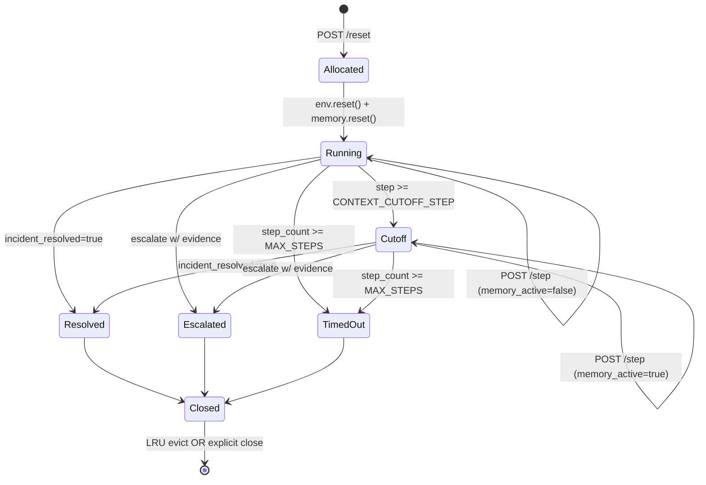

# Session Lifecycle — From `/reset` to Termination

> Status: shipped in Issue #1 (`SessionManager` + required `X-Session-Id` on `/step` and `/state`).
>
> The temporal contract every endpoint, scenario, and test agrees on.
> Cross-references [`ConcurrencyModel.md`](./ConcurrencyModel.md),
> [`MemoryModel.md`](./MemoryModel.md), and [`APIContract.md`](./APIContract.md).

---

## 1. State machine



Each transition is observable from the outside via the `done` flag and `state` payload.

---

## 2. Per-state guarantees

| State     | `done` | `incident_resolved` | `memory_active` | New `/step` allowed? |
| --------- | ------ | ------------------- | --------------- | -------------------- |
| Allocated | false  | false               | false           | yes                  |
| Running   | false  | false               | false           | yes                  |
| Cutoff    | false  | false               | true            | yes                  |
| Resolved  | true   | true                | last value      | no — call `/reset`   |
| Escalated | true   | depends             | last value      | no                   |
| TimedOut  | true   | false               | last value      | no                   |
| Closed    | n/a    | n/a                 | n/a             | no — session evicted |

Calling `/step` against a `done=true` session returns 400 with `detail="Episode finished. Call /reset to start a new one."`. (Same shape as the existing 400 paths.)

---

## 3. Eviction policy

- LRU on access, capped at `max_sessions = 128` (env var `PRAXIS_MAX_SESSIONS`).
- Evicted sessions release memory immediately (`PraxisMemory.reset()` is called from `__del__`-equivalent path; we do not rely on the GC).
- Eviction logs:
  ```
  WARN session_manager: Evicted session=<sid> task=<task> step=<n> reason=lru
  ```
  These are surfaced in `/health` payload via a rolling counter so judges spot misuse.

---

## 4. Episode-id strategy

- Format: `<task_name>_<server_episode_count>` (existing pattern at `server/praxis_environment.py:98`).
- We **do NOT** reuse session id as episode id; one session can run only one episode (a fresh `/reset` requires a fresh session id today). This keeps trajectories trivially indexable for Trackio.
- A single client wanting two episodes should call `/reset` twice and use both session ids.

---

## 5. Memory lifecycle inside a session

```
session.allocate()
└── PraxisEnvironment.__init__()
    └── PraxisMemory()                          # empty
session.allocate() ↦ env.reset(task, session_id=<uuid4>)
├── scenario.reset(episode_id)                   # scenario state cleared
└── memory.reset()                               # findings cleared
loop /step
├── if action ∈ {save, recall} → mutate memory
├── if action ∈ {query_logs, check_logs} and cutoff active
│   └── emit memory.illegal_log_after_cutoff + context-limit marker
└── observation.investigation_result =
    memory.get_observation_context(history, step)
session.close() (LRU or explicit)
└── memory.reset()                               # belt-and-braces
```

Memory **never** survives `reset` and **never** crosses sessions. Tests in Issue #13 enforce both.

---

## 6. Done detection (authoritative)

`PraxisEnvironment.step()` is the only place that decides `done`. Order of checks:

1. Scenario `step` returned `incident_resolved=True` → `done=true`, write `done` to obs.
2. Else `BaseScenario.is_done()` → True if `_step_count >= MAX_STEPS`.
3. Else False.

Escalation that satisfies the evidence threshold sets `incident_resolved=True` inside the scenario, so it falls into branch 1.

---

## 7. Stdout reproducibility

The inference contract emits exactly one `[START]` and one `[END]` per session. The `[END]` line includes `success=<incident_resolved>` and the comma-separated reward vector — judges parse this to score Phase 2 (agentic eval).

```
[START] task=cascading-platform-failure env=praxis model=Qwen/Qwen2.5-7B-Instruct
[STEP] step=1 ... reward=0.03 done=false error=null
...
[STEP] step=120 ... reward=0.05 done=true error=null
[END] success=true steps=120 rewards=0.03,0.01,0.05,...,0.20
```

Issue #17 (server validation) asserts this for all 6 tasks under `< 20 min` total runtime on `vCPU=2 / 8 GB`.

---

## 8. Failure modes (and the responses we return)

| Cause                             | HTTP | Body                                                            |
| --------------------------------- | ---- | --------------------------------------------------------------- |
| Missing `X-Session-Id` on `/step` | 400  | `"detail": "Missing X-Session-Id header"`                       |
| Unknown session id                | 400  | `"detail": "No active session for that id"`                     |
| Episode already done              | 400  | `"detail": "Episode finished. Call /reset to start a new one."` |
| Unknown task name on `/reset`     | 400  | `"detail": "Unknown task: <name>"`                              |
| Internal exception in scenario    | 500  | `"detail": "step() error: <repr>"` (logged at `ERROR`)          |

No code path raises bare exceptions to the client; scenarios always return `StepOutcome` with reward 0.

---

## 9. Observability hooks

Logged at `INFO` per transition (Issue #1 + #6 add these):

```
INFO praxis: session=<sid> /reset task=<task> seed=<seed?>
INFO praxis: session=<sid> /step  step=<n> action=<at> reward=<r> done=<bool> memory_active=<bool>
INFO praxis: session=<sid> closed reason=<resolved|escalated|timeout|lru>
```

Counters exposed at `GET /health.metrics` (optional, behind `ENABLE_METRICS=true`):

- `praxis_sessions_active`
- `praxis_sessions_evicted_total`
- `praxis_steps_total{task}`
- `praxis_episodes_done_total{task,outcome}`

These are nice-to-have; the hackathon submission does not require them.
